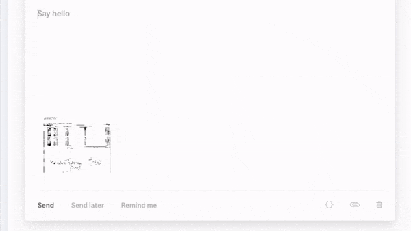

# Updates

## 01-16-2024

* Expenses with attachments will now be noted with a 📎 symbol on the Expenses tab.

## 12-30-2024

* Expenses:
  * Categories have been streamlined to a single dropdown.
  * 'Budgeted' has been added to disambiguate budgeted expenses versus actuals.
  * Soon to come - Event Templates that include automatically adding expenses and budgeted costs (soon to replace 'Planned Spends')
* Under the hood developments to speed up automations and prevent errors

## 11-24-2023

* Better ad campaign matching algorithm rolled out to reduce false positives.
*   Imported digital ad spends now display stats\

    <figure><figcaption></figcaption></figure>

## 11-20-2023

* Stricter standards to match ticket counts with the right event to reduce false positives.

## 11-14-2023

\[Beta] Adpack attachments can now be merged into a single PDF (images or PDF files only).

<figure><figcaption></figcaption></figure>

## 11-10-2023

**NEW FEATURE - Automatic Receipts/Invoice Reader (Beta)**

Simply forward your invoiced to an email and Sparrow will automatically categorize them for you.  Interested in testing this feature? Contact us to join the Beta.  [Learn more »](../tutorials/integrations/automatic-receipts-invoice-reader.md)

<figure><figcaption></figcaption></figure>

## 10-18-2023

*   Users can optionally get notified of new task assignments by email:\

    <figure><figcaption></figcaption></figure>

## 09-15-2023

* **New AI event builder** - You can now forward confirmation emails to a specific inbox and it will automatically import data from it. Talk to your account rep if interested.
* Meta ad spends match automatically now if you include an event name, date and venue in the campaign name.

## 08-28-2023

* Significantly improved event ticket count matching algorithm.  Using an A.I. powered algorithm, our system matching ticket counts back to their Sparrow events has been supercharged.
* Single event Ticketmaster beta integration launched.  Previously you could only send ticketing data from all events in the organization, rather than one specific event. Talk to your account rep to join the beta.

## 08-23-2023

* AXS ticketing Integration is now live
* New events now automatically categorize and pull in key details: Genre, Similar Artists, Press Photo, Social Media Links
* Facebook ad spends import daily now as opposed to weekly and pull in additional data from the campaign

## 07-21-2023

* Do Research Automation - Added a deep link to search Soundcharts

## 06-20-2023

* Rolled out Multi-Day Events on all accounts.
* Convert a Planned Spend to an Expense in one click. Just press the icon in your Planned Spends

<figure><figcaption></figcaption></figure>

## 06-06-2023

* Added a "Set all due dates to" advanced setting for Task Groups that allows you to override all due dates in the task group

## 04-27-2023

* Daily email report now reports upcoming On Sale dates instead of Announces

## 04-12-2023

* Major performance improvements in speed across the entire application.
* Event spends can now be downloaded ad hoc as a CSV
* Security improvements, particularly as it relates to archived users

<figure><figcaption></figcaption></figure>

## 03-18-2023

* Significant performance improvements, specifically in the speed of automations. Initial testing shows that automations typically complete within 2 minutes.
* Research Automation now includes artist links and a more useful Google Search link
* Automations now show a "Settings" menu where you can see information about who created it, what time, and what event.
* Minor security improvement related to automations.

### 03-11-2023

* Released minor security improvements
* \[BETA UPDATE] Wrap charts now include daily wraps as a bar chart

<figure><figcaption></figcaption></figure>

## 03-09-2023

* **Repeat Tasks**
  * For tasks that are not associated with a specific event, you can now have them automatically repeat upon completion.  For example, if you want the task "Create a monthly calendar social media graphic" that repeats every 30 days, you can set that up.  Once the task is moved to _Done_, a new task will be created that's X days out from the old due date.\
    \
    You can access this when creating a new task under _Date Settings._  Repeatable tasks are denoted with a ↻ symbol.

<figure><figcaption></figcaption></figure>

 

<figure><figcaption></figcaption></figure>

### 02-27-2023

* Email reports
  * Formatting - Wraps now show in green if there's a positive increase.
  * Fixed bug that didn't send reports out daily if you selected "1 day" wrap count
  * Fixed bug that sometimes displayed code instead of the wrap value
  * Fixed bug where event thumbnails wouldn't show up in the email

## 02-24-2023

* **Adpack Automation Attachments** -&#x20;
  * You can now download all attachments that you uploaded to an expense in an event.  To use, go to _Automations > Add New_, select your event, select _Create Adpack_, choose a template, and toggle "Include Attachments?" on.\
    \
    Once the automation completes, you'll see an option to download all expense attachments for that event as a Zip file:

<figure><figcaption></figcaption></figure>

 

<figure><figcaption></figcaption></figure>

* **Ticketweb Integration** -&#x20;
  * Sparrow now supports Ticketweb in its ticketing integration!  To activate, contact your client rep.\

* **Email Reports** -&#x20;
  * Email reports now include 1 day ticket wrap counts for events. &#x20;
  * Reports are now sent 1 hour earlier in the day.\

* **Task Group Automation** -
  * We added a new option that allows you to re-assign ALL tasks in a task group to certain user(s).  To use this, go to _Automations > Add New_, select your event, select _Add Task Groups_, and choose task group(s).  Then, select "Advanced Settings" and under "Assign all tasks to user(s):" select the users.\
    \
    \

* **Updates Page** - This page was created to track product updates.\

* When saving information, it'll now temporarily gray out the fields to prevent further editing.
* A newly styled toggle field for "Advanced Settings" across Sparrow.
* Dropdowns that went off-screen will now adjust accordingly.
